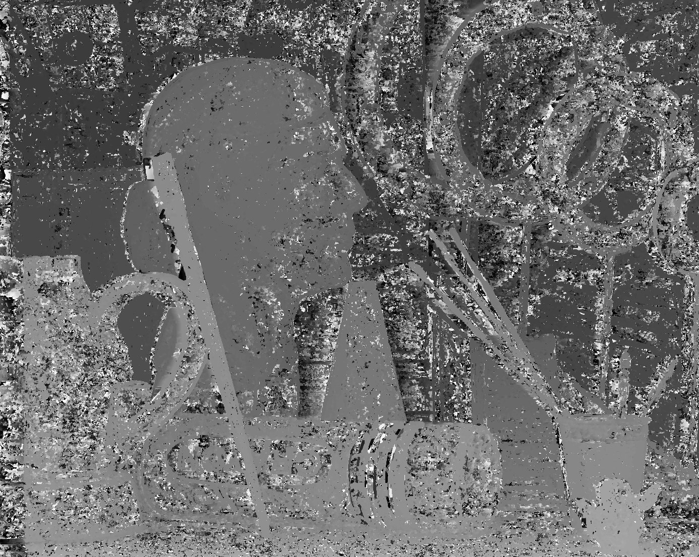
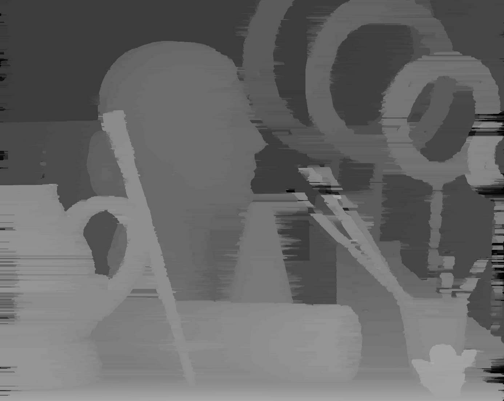
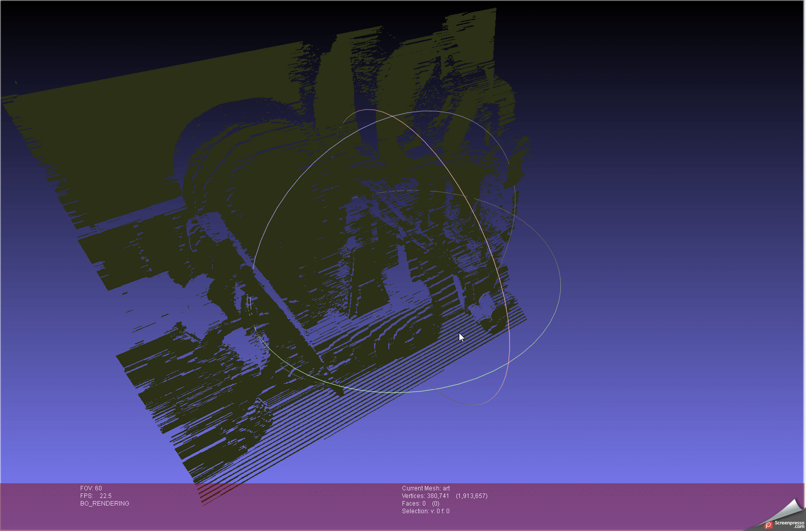

# Depth reconstruction from stereo images
---
## example usage

```
stereo_matching.exe img_path_1 img_path_2 output_name
```

or

```
stereo_matching.exe img_path_1 img_path_2 output_name focal_length baseline dmin
```

or

```
stereo_matching.exe img_path_1 img_path_2 output_name focal_length baseline dmin window_size weight
```

---
## result on low illumination, high resolution exapmle, where views are close

### original inputs

  

### result with a window size of 5, and a occlusion weight of 20 (left: naive, right: dynamic programming):

  

### constructed 3d point cloud




---

For other results see the results folder, and the corresponding data folders. I noticed, that a "good" weight value greatly depends on the illumination of the image. Also, as the views get more distant, disparity values increase, so in that case, we should not scale the output image up!
